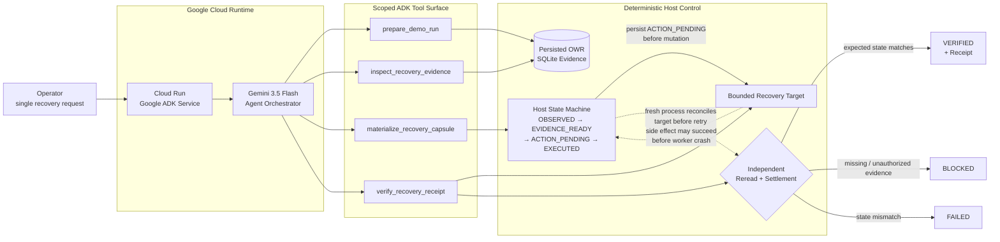
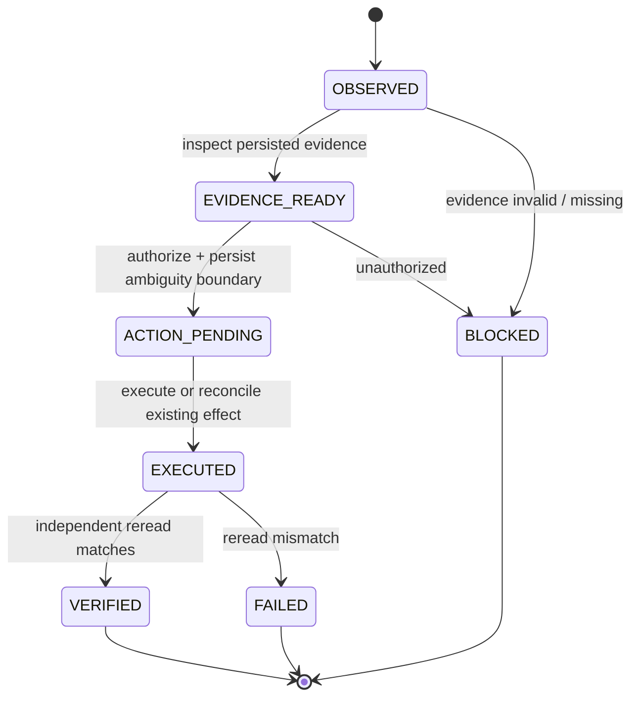

# Architecture

```text
canonical / OpenAI-style / mapped generic JSONL
→ bounded parser and provider adapter
→ secret rejection or optional pre-storage redaction
→ immutable validated Interaction records
→ atomic idempotent SQLite upsert
→ repo-scoped lexical duplicate analysis
→ deterministic context capsules and recovery reports
→ CLI / JSON / CSV / read-only HTTP API
```

## Boundaries

- `adapters.py` maps external records to the canonical interaction contract.
- `privacy.py` detects credential-like material and performs explicit redaction.
- `pipeline/ingest.py` owns size limits, parsing, atomicity, and rejection reporting.
- `storage/sqlite_store.py` owns persistence, analysis, query, repository summaries, and purge.
- `pipeline/reports.py` renders evidence-bounded JSON and Markdown reports.
- `server.py` is read-only and token-gated beyond loopback.

No vector database, message broker, external LLM, graph database, or SaaS service is required by the active runtime.




Gemini / Google ADK owns:
- choosing the next scoped tool
- orchestrating the multi-step workflow

Deterministic host code owns:
- evidence existence
- finding authorization
- legal state transitions
- path containment
- the permitted mutation
- ACTION_PENDING persistence
- reconcile-before-retry
- final verification


