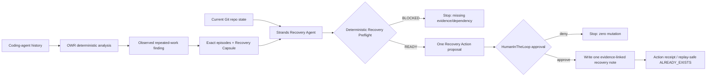

# Recovery Agent — Agents for Humans

**Track:** Professional Agents  
**Core:** coding-agent history + repository state → repeated-work evidence → Recovery Capsule → deterministic preflight → one bounded next action → human approval → execution receipt.

Recovery Agent is not another coding copilot. It detects when a developer or coding agent is about to reconstruct investigation that has already happened, restores the evidence, and surfaces only when one bounded repository action needs approval.

## End-to-end behavior



## Why Strands

Strands owns the agent loop and tool orchestration. Read-only evidence tools and deterministic proposal/preflight tools are allow-listed. `execute_approved_recovery_action` is deliberately the only mutating tool and is not allow-listed, so Strands `HumanInTheLoop` must approve it before execution.

The model does **not** determine whether evidence exists, whether a finding is persisted, whether preflight passes, or whether a side effect occurred. Those boundaries remain deterministic and receipt-backed.

## Install

From this directory:

```bash
python -m venv .venv
source .venv/bin/activate  # Windows: .venv\Scripts\activate
python -m pip install -e ".[dev]"
```

The hackathon package includes the Strands OpenAI provider for the explicit credentialed judge/demo path. Credential-free deterministic tests do not call a model.

## Run against existing OWR state

```bash
recovery-agent \
  --owr-root /path/to/owr-state \
  --repo /path/to/git/repo \
  --prompt "Recover the strongest repeated investigation and prepare one bounded next action."
```

Expected journey:

1. Strands calls `inspect_coding_history`.
2. Strands calls `inspect_repository`.
3. It chooses at most one persisted finding.
4. It calls `get_recovery_evidence`.
5. It calls `run_recovery_preflight`.
6. If preflight is ready, it calls `propose_bounded_recovery_action`.
7. Before `execute_approved_recovery_action`, Strands `HumanInTheLoop` prompts the human.
8. Denial stops with zero mutation; approval writes exactly one `.recovery/recovery-<finding>.md` note.
9. The tool returns an `EXECUTED` or replay-safe `ALREADY_EXISTS` receipt.

## Credentialed live proof

Set a real OpenAI credential and run a synthetic, sanitized end-to-end fixture through the actual Strands model provider and tools:

```bash
export OPENAI_API_KEY=...
recovery-agent-live-smoke \
  --model gpt-4o-mini \
  --approval stdio \
  --output proof/live-agent-receipt.json
```

`stdio` is the judge-video path: the mutating tool visibly pauses for operator approval. For an explicit non-interactive smoke branch, use `--approval yes` or `--approval deny`; the resulting receipt records that approval mode and must not be presented as an interactive human decision.

A repository-level GitHub Actions workflow, `agents-for-humans-live-receipt`, exposes the same path via manual `workflow_dispatch`. Add `OPENAI_API_KEY` as a repository Actions secret, dispatch the workflow, and GitHub uploads the sanitized JSON receipt as an artifact tied to the exact commit SHA.

The live receipt proves credentialed model invocation and actual Strands tool orchestration on a synthetic sanitized fixture. It does not claim real customer history or production deployment.

## Deterministic judge receipt

`recovery_agent.judge_runs` exercises three credential-free hostile scenarios and emits one JSON receipt:

- approved bounded action + replay-safe no-overwrite
- human-denial branch with zero mutation
- stale persisted evidence after proposal/approval with zero mutation

These scenarios prove the deterministic safety boundary independently of model variability. They do not claim LLM reasoning quality.

## Failure behavior

- no repeated-work finding → `NO_ACTION` at the agent level
- missing persisted finding → preflight `BLOCKED`
- missing Recovery Capsule → preflight `BLOCKED`
- unreadable/non-Git repository → preflight `BLOCKED`
- path escape attempt → rejected
- evidence changes between proposal and execution → rejected
- duplicate execution → existing note preserved; no overwrite
- human denial → Strands prevents mutating tool execution

## Pre-existing work disclosure

This hackathon subproject was created during the **Agents for Humans** submission period.

It incorporates and depends on pre-existing work as follows:

- **Operational Waste Recovery / ReworkTrace (pre-existing):** canonical coding-agent event storage, deterministic repeated-work analysis, evidence review projection, SQLite persistence, and Recovery Capsule generation. This project pins the reused baseline at OWR commit `e1c8bc8f3d9d57b87ba8adce62fe7f8ea78bc6a7`.
- **Reality Handoff Agent (pre-existing design work):** the evidence → deterministic readiness → exact bounded action → human approval → verification/handoff pattern informed this agent's control boundary. No Reality Handoff source package is copied into this subproject.
- **Agent Reliability Preflight / DriftGuard (pre-existing design work):** the fail-closed principle that deterministic blockers outrank semantic model judgment informed `run_recovery_preflight`. No DriftGuard source package is copied into this subproject.

### New work for Agents for Humans

- Strands `Agent` orchestration
- Strands tool surface around OWR evidence + repo state
- deterministic Recovery Preflight for this workflow
- `RecoveryAction` / `ActionReceipt` contracts
- Strands `HumanInTheLoop` approval boundary
- bounded repository Recovery Note action
- replay/evidence-drift/path-containment failure handling
- credentialed live-model receipt path
- hackathon-specific tests, demo, architecture, and deployment work

## Evidence boundary

Repeated-work similarity is evidence of recurrence, not proof of wasted labor. Token/cost fields remain bounded estimates where applicable. Recovery Agent never claims realized ROI or savings without external measurement.
