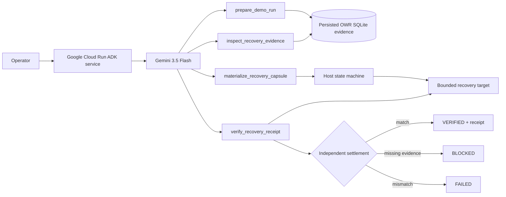

# Recovery Taskmaster — Google All Things Agentic

**Category:** Taskmaster  
**Deadline:** August 31, 2026, 5:00 PM PT  
**Stack:** Gemini 3.5 Flash + Google ADK + Vertex AI + Google Cloud Run  
**Core proof:** the agent takes a real bounded action, but host code will not call the workflow complete until the resulting state has been independently reconciled and verified.

## The friction in 15 seconds

Interrupted or retried agent work loses operational continuity. The immediate cost is repeated investigation. The dangerous edge is worse: an action can succeed externally, the worker can die before recording success, and a fresh worker can blindly perform the action again.

Recovery Taskmaster turns that into one autonomous workflow:

```text
recover persisted evidence
→ establish current state
→ perform one bounded recovery action
→ independently reread the result
→ VERIFIED | BLOCKED | FAILED
```

The architectural differentiator is the ambiguous-execution path:

```text
ACTION_PENDING persisted
→ side effect happens
→ process dies before EXECUTED is persisted
→ fresh process starts
→ reconcile target before any retry
→ effect exists: do not execute again
→ verify receipt
→ VERIFIED
```

**This is not a chatbot.** Success is a state transition with a machine-checkable receipt, not model prose.

## User workflow

One operator request starts the workflow:

```text
Complete a recovery workflow for run_id judge-demo-01.
Do the work end to end and stop only at VERIFIED or an explicit blocked state.
```

Gemini then works through four scoped ADK tools:

```text
prepare_demo_run
→ inspect_recovery_evidence
→ materialize_recovery_capsule
→ verify_recovery_receipt
→ VERIFIED
```

The judge/demo fixture is intentionally synthetic and sanitized so the workflow is reproducible without exposing private coding history. The BYOF friction is real: interrupted coding-agent work repeatedly reconstructing investigation before useful work resumes.

## Why this maps directly to the Taskmaster rubric

| Official criterion | Weight | Judge-visible evidence |
| --- | ---: | --- |
| **Innovation & Operational Utility** | **40%** | A messy multi-step continuity chore is intercepted and completed autonomously; the system takes action rather than returning advice; no human manually orders the tools. |
| **Architectural Discipline & Tech Stack** | **30%** | Gemini 3.5 + ADK + Vertex AI + Cloud Run; persisted state; four scoped tools; host-enforced legal transitions; bounded paths; fail-closed evidence gates; `ACTION_PENDING`; reconcile-before-retry; independent verification. |
| **Demo & Production Readiness** | **30%** | Public repo, architecture diagram, reproducible tests, exact Cloud Run URL/revision receipt, live remote Gemini/ADK trace, terminal `VERIFIED`, Cloud Run logs and receipt pack. |

## Architecture



The model is autonomous over workflow progression **inside** the tool contract. It is not authoritative over truth.

```text
Gemini / ADK owns:
- choosing the next scoped tool
- completing the multi-step workflow

Host code owns:
- evidence existence
- legal state transitions
- finding authorization
- path containment
- the only permitted mutation
- ambiguous-execution reconciliation
- final verification
```

## Host-owned state machine

The current implementation—not an aspirational diagram—is:

```text
OBSERVED
  ↓ inspect exact persisted evidence
EVIDENCE_READY
  ↓ persist ambiguity boundary before mutation
ACTION_PENDING
  ↓ execute OR reconcile an already-existing effect
EXECUTED
  ↓ independent reread
VERIFIED | FAILED

missing/unauthorized evidence or illegal transition → BLOCKED
```

### The crash window we explicitly test

```text
1. persist ACTION_PENDING
2. perform the side effect
3. crash before EXECUTED is durably recorded
4. start a fresh process
5. observe ACTION_PENDING
6. reread the target before retry
7. if effect exists, reconcile it rather than execute again
8. verify expected SHA == observed SHA
9. reach VERIFIED with action_count == 1
```

That directly addresses the distributed-systems failure mode where “tool call returned” and “external state safely settled” are not equivalent.

## Agent authority surface

The ADK agent has exactly four tools:

1. `prepare_demo_run(run_id)` — create one deterministic sanitized history/workspace fixture and persist `OBSERVED`.
2. `inspect_recovery_evidence(run_id, finding_id)` — load exact persisted evidence; host code advances only a legal `OBSERVED → EVIDENCE_READY` transition.
3. `materialize_recovery_capsule(run_id, finding_id)` — persist `ACTION_PENDING`, perform the sole allowed mutation, or reconcile an existing effect before retrying.
4. `verify_recovery_receipt(run_id, finding_id, expected_sha256)` — independently reread the target and settle `EXECUTED → VERIFIED | FAILED`.

The model cannot choose arbitrary output paths, run shell commands, write outside the isolated workspace, overwrite an existing recovery artifact, invent an authorized finding, or certify its own side effect.

## Failure semantics

```text
invalid run_id/path     → rejected / zero action
missing preparation     → BLOCKED / zero action
wrong finding_id        → BLOCKED / zero action
missing evidence        → BLOCKED / zero action
illegal transition      → BLOCKED
ambiguous prior action  → reconcile target before retry
replay after execution  → ALREADY_EXISTS / same target / no overwrite
hash mismatch           → FAILED
verified reread         → VERIFIED
```

## Real external-system reconciliation proof

The core Taskmaster action is deliberately bounded to an isolated recovery artifact for a deterministic judge demo. Separately, the repo includes a hostile proof harness against the **GitHub Contents API** to test the same ambiguity boundary against a real remote system:

```text
persist ACTION_PENDING locally
→ perform one real GitHub remote mutation
→ terminate before local success settlement
→ fresh Python process
→ GET remote GitHub state before any retry
→ compare expected vs observed content hash
→ require one remote mutation commit
→ emit settlement receipt
→ clean up the ephemeral proof branch
```

Implementation:

- [`scripts/github_external_reconciliation.py`](scripts/github_external_reconciliation.py)
- [`.github/workflows/taskmaster-external-reconciliation.yml`](../../../.github/workflows/taskmaster-external-reconciliation.yml)

This supports the architecture claim; it does not turn the judge fixture into a claim of production-scale distributed exactly-once execution.

## Google stack and deployment

Contest-specific runtime:

- Gemini 3.5 Flash (`gemini-3.5-flash`)
- Google Agent Development Kit (ADK)
- Vertex AI (`GOOGLE_GENAI_USE_VERTEXAI=TRUE`)
- Google Cloud Run
- FastAPI ADK service
- GitHub Actions
- SHA-256 receipts

Authentication is **keyless**:

```text
GitHub Actions OIDC
→ Google Workload Identity Federation
→ recovery-taskmaster-deployer@signalops-506419.iam.gserviceaccount.com
```

No long-lived service-account JSON key is required by the live workflow.

One-time project prerequisites are the relevant Google Cloud APIs plus the minimum IAM needed for Cloud Run source build/deploy and Vertex AI invocation. The build identity uses `roles/run.builder`.

## Live Google Cloud proof

Canonical workflow:

```text
.github/workflows/all-things-agentic-live.yml
```

It performs:

```text
keyless OIDC authentication
→ required API check
→ exact-source Cloud Run deploy
→ capture public URL + ready revision
→ optional advisory health probe
→ invoke deployed Gemini/ADK service
→ require live trace to contain VERIFIED
→ capture Cloud Run logs
→ publish receipt pack
```

The health endpoint is **not** the proof gate. The decisive condition is the remote deployed agent actually completing the workflow to `VERIFIED`.

Latest sanitized live status:

[`proof/taskmaster-google-live-latest.json`](https://github.com/leadingproblemsolver/operational-waste-recovery/blob/proof/taskmaster-google-live-status/proof/taskmaster-google-live-latest.json)

## Local verification

From this directory:

```bash
python -m venv .venv
source .venv/bin/activate
pip install -r requirements.txt
pip install pytest
pytest -q
```

Tests cover the normal success path plus replay/idempotency, missing evidence, invalid paths, hash mismatch, host-state ordering and the ambiguous post-action crash/reconciliation path.

## What the final video must prove

The official rubric heavily rewards undeniable proof rather than feature count. The <=4 minute video should therefore show only this:

```text
0:00  friction: interrupted/retried agents can repeat work or side effects
0:25  architecture: Gemini orchestrates; host code controls truth and settlement
0:55  Google Cloud Run exact service/revision
1:15  unedited live Gemini/ADK workflow
2:30  bounded action + SHA receipt + VERIFIED
3:00  ambiguous crash test: ACTION_PENDING → reconcile → action_count 1
3:35  repo / receipt / pre-existing-work disclosure
3:55  stop
```

No frontend polish, extra agents or extra providers are required for this proof.

## Pre-existing work disclosure

Operational Waste Recovery is an explicitly disclosed pre-existing dependency pinned at commit `e1c8bc8f3d9d57b87ba8adce62fe7f8ea78bc6a7`. It supplies persistence, deterministic repeated-work detection, evidence review and Recovery Capsule generation.

Contest-specific work includes the Gemini/ADK Taskmaster application layer, four bounded tool contracts, host-owned execution state machine, ambiguous-crash reconciliation path, Cloud Run service/deployment proof, external reconciliation harness, tests, receipts and submission material.

Reality Handoff and Agent Reliability Preflight informed the fail-closed design principle; their source is not copied into this submission.

## Claim boundary

A green hosted receipt proves that the exact source was deployed to Google Cloud Run and that Gemini through Google ADK completed this bounded workflow to a captured `VERIFIED` terminal state. The hostile tests demonstrate specific retry/reconciliation invariants under controlled conditions.

It does **not** prove customer adoption, real-user corpus performance, realized financial savings, production scale, logistics-operator deployment, universal exactly-once semantics or hackathon placement.

## Submission completion gate

```text
[x] local/CI bounded workflow proof
[x] host-enforced state machine
[x] ambiguous-crash/no-duplicate recovery test
[x] keyless OIDC/WIF Google authentication
[x] Cloud Run deployment path
[x] public repository + architecture
[x] pre-existing-work disclosure
[ ] green remote Gemini/ADK → VERIFIED receipt
[ ] public <=4 minute YouTube/Vimeo demo
[ ] Devpost final fields + submit
```

After those three unchecked items, stop building and submit.
