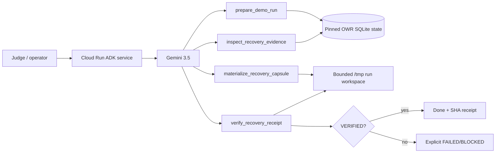

# Recovery Taskmaster — Google All Things Agentic

**Category:** Taskmaster  
**Deadline:** August 31, 2026  
**New contest work:** Google ADK/Gemini orchestration, bounded autonomous recovery workflow, Cloud Run service/deployment path, tests, demo receipts, and submission material.  
**Reused pre-existing work:** Operational Waste Recovery (OWR) is pinned as a library dependency at commit `e1c8bc8f3d9d57b87ba8adce62fe7f8ea78bc6a7` and provides deterministic persisted repeated-work analysis + Recovery Capsules.

Recovery Taskmaster is a coding-continuity agent that **finishes work**, rather than answering a question:

```text
sanitized coding-agent history + isolated workspace
        ↓
Gemini 3.5 via Google ADK
        ↓
prepare deterministic OWR run
        ↓
inspect exact persisted repeated-work evidence
        ↓
materialize one bounded Recovery Capsule artifact
        ↓
independently reread + verify SHA-256 receipt
        ↓
VERIFIED terminal state
```

It exists to prevent a developer or coding agent from reconstructing investigation that already happened. The agent restores evidence into the working context and proves the action happened with an independently reread receipt.

## Judging criteria → feature map

| Criterion | Weight | Recovery Taskmaster evidence |
| --- | ---: | --- |
| Innovation & Operational Utility | 40% | Detects already-completed coding investigation and autonomously materializes recovery context before more work is reconstructed. The workflow terminates in a real file action + receipt, not chat advice. |
| Architectural Discipline & Tech Stack | 30% | Gemini 3.5 + Google ADK; deterministic OWR evidence boundary; four scoped tools; strict run workspace containment; observed vs inferred separation; replay-safe action; independent SHA verification. |
| Demo & Production Readiness | 30% | FastAPI ADK service, Dockerfile, Cloud Run deployment script, health endpoint, CI test/import/container gate, live Google Cloud URL as final submission receipt. |

## Agent tools

The ADK agent receives exactly four tools:

1. `prepare_demo_run(run_id)` — creates one isolated sanitized history/workspace fixture and returns the strongest persisted finding.
2. `inspect_recovery_evidence(run_id, finding_id)` — returns exact OWR episodes + Recovery Capsule; missing evidence blocks.
3. `materialize_recovery_capsule(run_id, finding_id)` — performs exactly one allowed action: write `.recovery/recovery-<finding>.md` inside the isolated workspace.
4. `verify_recovery_receipt(run_id, finding_id, expected_sha256)` — independently rereads the artifact and compares the actual hash to the action receipt.

The model cannot write arbitrary files, execute shell commands, choose paths, fabricate finding IDs, or certify its own side effect.

## Failure semantics

```text
missing finding/capsule → BLOCKED → no action
invalid run_id/path      → rejected → no action
first valid execution    → EXECUTED + SHA-256
replay                   → ALREADY_EXISTS + same SHA; no overwrite
hash mismatch            → FAILED
verified reread          → VERIFIED
```

Repeated-work similarity is **not** presented as proof of wasted labor or realized savings.

## Run locally

From this directory:

```bash
python -m venv .venv
source .venv/bin/activate
pip install -r requirements.txt
pip install pytest
pytest -q
```

For Google AI Studio development:

```bash
export GOOGLE_GENAI_USE_VERTEXAI=FALSE
export GOOGLE_API_KEY='...'
adk web .
```

For Google Cloud / Vertex AI:

```bash
export GOOGLE_GENAI_USE_VERTEXAI=TRUE
export GOOGLE_CLOUD_PROJECT='your-project-id'
export GOOGLE_CLOUD_LOCATION='global'
gcloud auth application-default login
adk web .
```

Prompt the agent with:

```text
Complete a recovery workflow for run_id judge-demo-01. Do the work end to end and stop only at VERIFIED or an explicit blocked state.
```

## Google Cloud bootstrap

The public proof workflow deploys from source and then calls Gemini through Vertex AI. A one-time GCP bootstrap is therefore required before the GitHub Actions live receipt can succeed.

Enable billing for the target project, then in Cloud Shell enable the required APIs:

```bash
PROJECT_ID='your-project-id'
gcloud config set project "$PROJECT_ID"
gcloud services enable \
  run.googleapis.com \
  cloudbuild.googleapis.com \
  artifactregistry.googleapis.com \
  aiplatform.googleapis.com \
  logging.googleapis.com
```

The deployment principal used by GitHub must be able to deploy Cloud Run source, consume/enable services, act as the runtime service identity, call Vertex AI, and read the proof logs. Google documents the core source-deploy roles as Cloud Run Source Developer + Service Usage Consumer + Service Account User; this receipt workflow also enables APIs and reads logs, so the bootstrap identity must have the corresponding administration/view permissions.

The runtime service identity must have Vertex AI User:

```text
roles/aiplatform.user
```

Cloud Run source builds also require the build service account to have Cloud Run Builder. For the default Compute Engine build identity:

```bash
PROJECT_NUMBER="$(gcloud projects describe "$PROJECT_ID" --format='value(projectNumber)')"
BUILD_SA="${PROJECT_NUMBER}-compute@developer.gserviceaccount.com"

gcloud projects add-iam-policy-binding "$PROJECT_ID" \
  --member="serviceAccount:${BUILD_SA}" \
  --role='roles/run.builder'
```

For the fastest hackathon path, use a dedicated short-lived deploy/runtime service account with only the roles necessary for this project, store its JSON credential only as the GitHub Actions repository secret `GCP_CREDENTIALS`, and delete/disable the key after submission. Do **not** commit the JSON file or paste it into issues, PRs, logs, or submission text.

The manual workflow `all-things-agentic-live-receipt` accepts the Google Cloud project ID as an input. Its defaults are:

```text
Cloud Run region: me-central1
Gemini / Vertex endpoint: global
service: recovery-taskmaster
run_id: judge-demo-01
```

## Cloud Run

The service uses ADK's supported `get_fast_api_app()` shape in `main.py` and exposes the standard ADK web/API surface plus `/healthz`.

Deploy directly from a prepared local Google Cloud environment:

```bash
export GOOGLE_CLOUD_PROJECT='your-project-id'
export CLOUD_RUN_REGION='me-central1'
export GOOGLE_CLOUD_LOCATION='global'
bash scripts/deploy_cloud_run.sh
```

Cloud Run placement and Gemini model endpoint are intentionally separate: the container may run in `me-central1`, while Gemini 3.5 Flash uses Google's supported `global` endpoint by default.

The script enables Cloud Run, Cloud Build, Artifact Registry and Vertex AI dependencies, deploys from source, sets `GOOGLE_GENAI_USE_VERTEXAI=TRUE`, and prints the resulting Cloud Run URL.

After deployment, collect these irreversible receipts:

```text
Cloud Run service URL + exact revision
GET /healthz → 200
live Gemini/ADK run → VERIFIED
Cloud Run execution/log evidence
≤4 minute public demo video
Devpost submitted receipt
```

## Architecture



## Pre-existing work disclosure

This submission does **not** claim OWR was built during the contest.

Pre-existing OWR supplies:
- canonical interaction persistence
- deterministic repeated-work detection
- persisted evidence review
- Recovery Capsule generation

The contest-specific work is the Google ADK/Gemini Taskmaster application layer, autonomous bounded workflow, tool contracts, workspace/action verification, Cloud Run packaging/deployment, testing, demo, and submission receipts.

Reality Handoff and Agent Reliability Preflight informed the design principle that deterministic evidence/failure gates outrank model assertions; their source is not copied into this submission.

## Claim boundary

The public judge fixture is explicitly synthetic and sanitized. A successful hosted demo can prove that Gemini through Google ADK completed the bounded workflow on Google Cloud, created the recovery artifact, and independently verified its receipt. It does **not** prove customer adoption, real-user corpus performance, realized financial savings, production scale, or hackathon placement.
