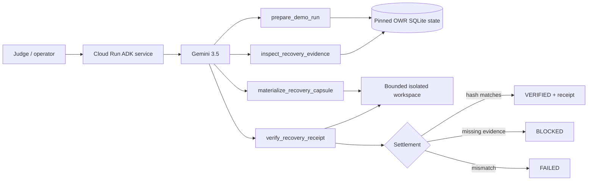

# Recovery Taskmaster — Google All Things Agentic

**Category:** Taskmaster  
**Deadline:** August 31, 2026, 5:00 PM PT  
**Core proof:** one autonomous workflow reaches a real bounded side effect and independently verified terminal state.

## One-line pitch

**Recovery Taskmaster is a Gemini 3.5 + Google ADK proof-carrying execution agent that recovers already-completed investigation from persisted evidence, performs exactly one bounded recovery action, and independently verifies the resulting state before declaring the workflow complete.**

```text
sanitized coding-agent history + isolated workspace
        ↓
Gemini 3.5 via Google ADK
        ↓
prepare deterministic persisted evidence
        ↓
inspect exact evidence + Recovery Capsule
        ↓
materialize one bounded recovery artifact
        ↓
independently reread + verify SHA-256
        ↓
VERIFIED | BLOCKED | FAILED
```

This is deliberately **not a chatbot**. The success condition is an externally inspectable state transition with a receipt.

## Why this is the Taskmaster entry

The personal friction is execution continuity: interrupted coding-agent work often causes the same investigation to be reconstructed before useful work resumes. Recovery Taskmaster intercepts that repeated-work pattern and autonomously completes the recovery chore end to end.

The judge/demo fixture is explicitly synthetic and sanitized so the full workflow is reproducible without exposing private coding history. It demonstrates the execution contract without claiming real-user adoption, production ROI, or realized savings.

## Logistinfra alignment — exact scope boundary

Recovery Taskmaster is the **agentic execution primitive** we want to carry forward into Logistinfra, not a full logistics product inside this hackathon.

The reusable execution contract is:

```text
persisted evidence
→ establish current state
→ choose one scoped action
→ execute inside a bounded authority surface
→ reread external state
→ independently verify settlement
→ durable receipt
```

That maps directly to Logistinfra's broader exception-to-action direction, where agents must not silently jump from uncertain evidence to a resolved state. For this hackathon, we keep the demonstrator narrow and honest: coding-continuity is the BYOF instance; proof-carrying execution is the reusable system contribution.

## Judging criteria → exact evidence

| Criterion | Weight | What the judge should see |
| --- | ---: | --- |
| Innovation & Operational Utility | 40% | A real multi-step background recovery chore completed autonomously; no manual tool ordering; a file is actually created; terminal state is not model prose but verified execution. |
| Architectural Discipline & Tech Stack | 30% | Gemini 3.5 + Google ADK + Cloud Run; persisted state; four scoped tools; no shell/arbitrary filesystem; path containment; fail-closed evidence gates; replay-safe mutation; independent SHA verification. |
| Demo & Production Readiness | 30% | Public repo, architecture diagram, reproducible setup, Cloud Run proof, unedited live tool sequence, exact revision/URL, health response, live trace and receipt pack. |

## Required stack

**Contest-specific**
- Gemini 3.5 Flash (`gemini-3.5-flash`)
- Google Agent Development Kit (ADK)
- Vertex AI (`GOOGLE_GENAI_USE_VERTEXAI=TRUE`)
- Google Cloud Run
- FastAPI ADK service
- four scoped Python tools
- isolated `/tmp/recovery-taskmaster/<run_id>` workspace
- SHA-256 execution receipts
- GitHub Actions deployment + live proof workflow

**Explicitly pre-existing dependency**
- Operational Waste Recovery pinned at commit `e1c8bc8f3d9d57b87ba8adce62fe7f8ea78bc6a7`
- supplies canonical persistence, deterministic repeated-work detection, evidence review and Recovery Capsule generation

No other project is presented as contest-created work.

## Agent authority model

The ADK agent gets exactly four tools:

1. `prepare_demo_run(run_id)` — prepare one deterministic sanitized history/workspace fixture and return the strongest persisted finding.
2. `inspect_recovery_evidence(run_id, finding_id)` — load exact persisted episodes + Recovery Capsule; missing evidence blocks.
3. `materialize_recovery_capsule(run_id, finding_id)` — perform exactly one permitted mutation: write `.recovery/recovery-<finding>.md` inside the isolated workspace.
4. `verify_recovery_receipt(run_id, finding_id, expected_sha256)` — independently reread the artifact and recompute its hash.

The model cannot invent finding IDs, choose arbitrary paths, run shell commands, write outside the run workspace, overwrite an existing recovery note, or certify its own side effect.

## State machine / failure semantics

```text
OBSERVED
  ↓
EVIDENCE_PRESENT ──missing──> BLOCKED
  ↓
ACTION_READY
  ↓
EXECUTED ──replay──> ALREADY_EXISTS
  ↓
INDEPENDENT_REREAD
  ↓
VERIFIED | FAILED
```

Additional hard gates:

```text
invalid run_id/path → rejected → zero action
missing finding      → BLOCKED  → zero action
missing capsule      → BLOCKED  → zero action
hash mismatch        → FAILED
replay               → same artifact/hash; no overwrite
```

## Architecture



## Expected judge-visible outcome

For `run_id=judge-demo-01`, the expected visible sequence is:

```text
prepare_demo_run
→ inspect_recovery_evidence
→ materialize_recovery_capsule
→ verify_recovery_receipt
→ VERIFIED
```

The irreversible proof pack should contain:

```text
exact Git commit SHA
Cloud Run public URL
Cloud Run exact revision
GET /healthz → 200
live Gemini/ADK tool trace
VERIFIED terminal state
Cloud Run logs
JSON receipt index
```

## Local verification

From this directory:

```bash
python -m venv .venv
source .venv/bin/activate
pip install -r requirements.txt
pip install pytest
pytest -q
```

Tests mechanically verify the positive path, replay/idempotency, missing evidence block, path escape rejection, and exact ADK model/tool contract.

## Live Google Cloud proof

Repository secret required:

```text
GCP_SA_KEY=<complete fresh service-account JSON>
```

One-time project bootstrap must be performed by a project owner/admin before the least-privilege deploy identity runs:

```bash
PROJECT_ID='your-project-id'
gcloud config set project "$PROJECT_ID"
gcloud services enable \
  run.googleapis.com \
  cloudbuild.googleapis.com \
  artifactregistry.googleapis.com \
  aiplatform.googleapis.com \
  logging.googleapis.com
```

Runtime/deploy identities then need only the roles required for Cloud Run source deployment, build, Vertex AI invocation, service-account use, and proof-log reads. The deploy workflow should not need API-administration authority after bootstrap.

Manual GitHub Actions workflow:

```text
all-things-agentic-live-receipt
project_id: <Google Cloud project>
run_region: me-central1
model_location: global
service: recovery-taskmaster
run_id: judge-demo-01
```

Canonical live prompt:

```text
Complete a recovery workflow for run_id judge-demo-01. Do the work end to end and stop only at VERIFIED or an explicit blocked state.
```

## Submission receipts checklist

```text
[ ] local tests green
[ ] exact submission head green in GitHub Actions
[ ] required Google Cloud APIs pre-enabled
[ ] GCP_SA_KEY stored as repository secret
[ ] Cloud Run URL + exact revision captured
[ ] /healthz returns 200
[ ] live Gemini/ADK trace reaches VERIFIED
[ ] receipt-index.json captured
[ ] <=4 minute public YouTube/Vimeo demo uploaded
[ ] Devpost hosted-project/repo/video fields completed
[ ] pre-existing OWR disclosure retained
[ ] social post with #AllThingsAgenticHackathon published (optional +0.2)
[ ] public build write-up published with contest disclosure (optional +0.2)
[ ] Devpost submission finalized
```

## Pre-existing work disclosure

This submission does **not** claim OWR was created during the contest. OWR supplies the deterministic persistence/evidence primitives listed above. Contest-specific work is the Gemini/ADK Taskmaster application layer, autonomous bounded workflow, four tool contracts, workspace/action verification, Cloud Run service/deployment path, tests, live proof workflow, and submission material.

Reality Handoff and Agent Reliability Preflight informed the design principle that deterministic evidence/failure gates outrank model assertions; their source is not copied into this submission.

## Claim boundary

A successful hosted demo proves that Gemini through Google ADK completed this bounded workflow on Google Cloud, created the recovery artifact, and independently verified its receipt. It does **not** prove customer adoption, real-user corpus performance, realized financial savings, production scale, logistics-operator deployment, or hackathon placement.
