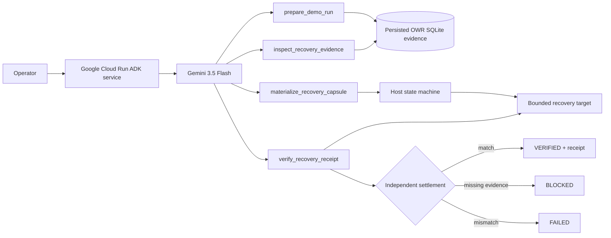

# Recovery Taskmaster — Google All Things Agentic

**Category:** Taskmaster  
**Stack:** Gemini 3.5 Flash + Google ADK + Vertex AI + Google Cloud Run  
**Live proof:** `VERIFIED` on source `74a01bcf11bc5c6a09462377f65bd6d8b1707a84`, Cloud Run revision `recovery-taskmaster-00002-2v6`  
**Service:** https://recovery-taskmaster-dzoo5fey5q-ww.a.run.app  
**Receipt:** https://github.com/leadingproblemsolver/operational-waste-recovery/blob/proof/taskmaster-google-live-status/proof/taskmaster-google-live-latest.json

## The friction in 15 seconds

Interrupted or retried agent work loses continuity. The immediate cost is repeated investigation. The dangerous edge is worse: an action can succeed externally, the worker can die before recording success, and the next worker can blindly repeat the action.

Recovery Taskmaster turns that into one autonomous workflow:

```text
recover persisted evidence
→ establish current state
→ perform one bounded recovery action
→ independently reread the result
→ VERIFIED | BLOCKED | FAILED
```

The differentiating failure path is:

```text
ACTION_PENDING persisted
→ side effect happens
→ process dies before EXECUTED is persisted
→ fresh process starts
→ reconcile target before retry
→ effect exists: do not execute again
→ verify receipt
→ VERIFIED
```

**This is not a chatbot.** Success is a verified state transition, not model prose.

## User workflow

One request starts the run:

```text
Complete a recovery workflow for run_id judge-demo-01.
Do the work end to end and stop only at VERIFIED or an explicit blocked state.
```

Gemini then works through four scoped ADK tools:

```text
prepare_demo_run
→ inspect_recovery_evidence
→ materialize_recovery_capsule
→ verify_recovery_receipt
→ VERIFIED
```

The judge fixture is synthetic and sanitized for reproducibility. The BYOF friction is real: interrupted coding-agent work repeatedly reconstructing investigation before useful work resumes.

## Direct rubric fit

| Criterion | Weight | Judge-visible evidence |
| --- | ---: | --- |
| **Innovation & Operational Utility** | **40%** | A messy multi-step continuity chore is completed autonomously; the system takes action rather than returning advice; no human manually orders the tools. |
| **Architectural Discipline & Tech Stack** | **30%** | Gemini 3.5 + ADK + Vertex AI + Cloud Run; persisted state; four scoped tools; host-enforced transitions; `ACTION_PENDING`; reconcile-before-retry; independent verification; keyless OIDC/WIF. |
| **Demo & Production Readiness** | **30%** | Public repo, architecture, reproducible tests, exact Cloud Run URL/revision, live remote Gemini/ADK trace, terminal `VERIFIED`, Cloud Run logs and receipt pack. |

## Architecture



```text
Gemini / ADK owns:
- choosing the next scoped tool
- completing the workflow

Host code owns:
- evidence existence
- legal state transitions
- finding authorization
- path containment
- the only permitted mutation
- ambiguous-execution reconciliation
- final verification
```

## Host-owned state machine

```text
OBSERVED
  ↓ inspect exact persisted evidence
EVIDENCE_READY
  ↓ persist ambiguity boundary before mutation
ACTION_PENDING
  ↓ execute OR reconcile an already-existing effect
EXECUTED
  ↓ independent reread
VERIFIED | FAILED

missing/unauthorized evidence or illegal transition → BLOCKED
```

### Crash-recovery proof

The hostile test deliberately crashes after the side effect but before local success settlement:

```text
persist ACTION_PENDING
→ perform side effect
→ crash
→ fresh process
→ reread target before retry
→ effect already exists
→ no duplicate action
→ expected SHA == observed SHA
→ VERIFIED with action_count == 1
```

That proves the runtime distinguishes **“tool call happened”** from **“external state safely settled.”**

## Agent authority surface

The agent has exactly four tools:

1. `prepare_demo_run(run_id)`
2. `inspect_recovery_evidence(run_id, finding_id)`
3. `materialize_recovery_capsule(run_id, finding_id)`
4. `verify_recovery_receipt(run_id, finding_id, expected_sha256)`

It cannot choose arbitrary output paths, run shell commands, write outside the isolated workspace, overwrite an existing recovery artifact, invent an authorized finding, or certify its own side effect.

## Real external-system reconciliation proof

A separate hostile harness applies the same ambiguity boundary to the **GitHub Contents API**:

```text
persist ACTION_PENDING locally
→ perform one real remote GitHub mutation
→ terminate before local success settlement
→ fresh process GETs GitHub state before retry
→ compare expected vs observed content hash
→ require one remote mutation commit
→ emit receipt
→ clean up ephemeral proof branch
```

Implementation:

- [`scripts/github_external_reconciliation.py`](scripts/github_external_reconciliation.py)
- [`.github/workflows/taskmaster-external-reconciliation.yml`](../../../.github/workflows/taskmaster-external-reconciliation.yml)

This supports the architecture claim without claiming universal exactly-once semantics.

## Google Cloud proof

Authentication is keyless:

```text
GitHub Actions OIDC
→ Google Workload Identity Federation
→ recovery-taskmaster-deployer@signalops-506419.iam.gserviceaccount.com
```

The live workflow performs:

```text
OIDC authentication
→ required API check
→ exact-source Cloud Run deploy
→ capture public URL + ready revision
→ advisory health probe
→ invoke deployed Gemini/ADK service
→ require live trace to contain VERIFIED
→ capture Cloud Run logs
→ publish receipt pack
```

The latest run succeeded even though `/healthz` returned 404; that probe is intentionally advisory. The decisive proof is the remote deployed agent reaching `VERIFIED`.

Verified receipt facts:

```text
proof_status: VERIFIED
workflow_status: success
source_commit_sha: 74a01bcf11bc5c6a09462377f65bd6d8b1707a84
cloud_run_revision: recovery-taskmaster-00002-2v6
verified_terminal_observed: true
```

## Local verification

```bash
python -m venv .venv
source .venv/bin/activate
pip install -r requirements.txt
pip install pytest
pytest -q
```

Tests cover the normal success path plus replay/idempotency, missing evidence, invalid paths, hash mismatch, host-state ordering and ambiguous post-action crash reconciliation.

## Final <=4 minute video

Show only what changes the score:

```text
0:00  friction: retries can repeat work or side effects
0:25  architecture: Gemini orchestrates; host code controls truth and settlement
0:55  exact Cloud Run service/revision
1:15  unedited live Gemini/ADK run
2:30  bounded action + receipt + VERIFIED
3:00  ACTION_PENDING crash → reconcile → action_count 1
3:35  repo + live receipt + pre-existing-work disclosure
3:55  stop
```

## Pre-existing work disclosure

Operational Waste Recovery is an explicitly disclosed pre-existing dependency pinned at commit `e1c8bc8f3d9d57b87ba8adce62fe7f8ea78bc6a7`. It supplies persistence, deterministic repeated-work detection, evidence review and Recovery Capsule generation.

Contest-specific work includes the Gemini/ADK Taskmaster layer, four bounded tool contracts, host-owned execution state machine, ambiguous-crash reconciliation path, Cloud Run service/deployment proof, external reconciliation harness, tests, receipts and submission material.

## Claim boundary

The green hosted receipt proves that the exact source was deployed to Google Cloud Run and that Gemini through Google ADK completed the bounded workflow to a captured `VERIFIED` terminal state. Controlled hostile tests demonstrate specific retry/reconciliation invariants.

It does **not** prove customer adoption, real-user corpus performance, realized financial savings, production scale, logistics deployment, universal exactly-once semantics or hackathon placement.

## Submission completion gate

```text
[x] local/CI bounded workflow proof
[x] host-enforced state machine
[x] ambiguous-crash/no-duplicate recovery test
[x] keyless OIDC/WIF Google authentication
[x] public repository + architecture
[x] exact Cloud Run deployment receipt
[x] remote Gemini/ADK → VERIFIED receipt
[x] pre-existing-work disclosure
[ ] public <=4 minute YouTube/Vimeo demo
[ ] Devpost final fields + submit
```

No more product building before those two remaining completion items.
